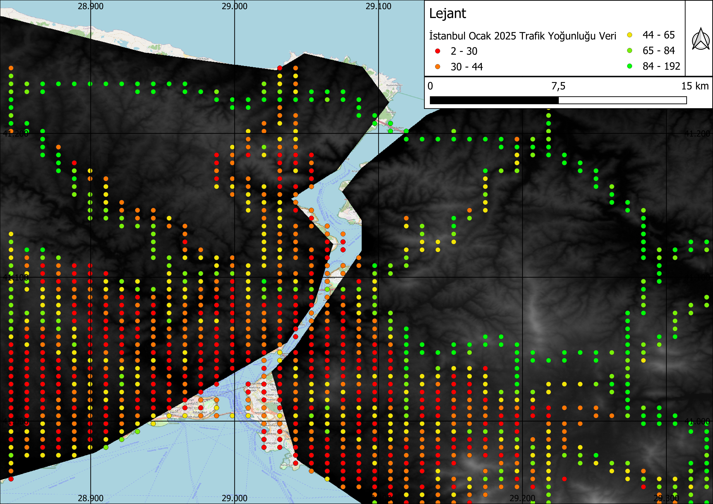
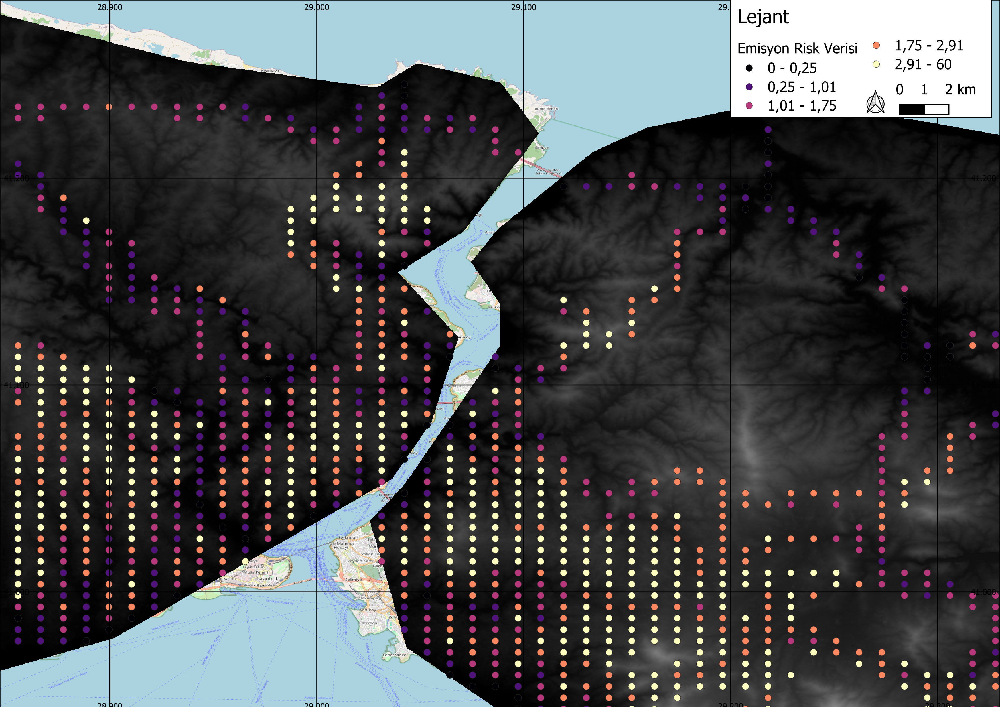

# 🌿 Eco-Dynamic Lite: Veri Tabanlı Emisyon Risk Analizi

[cite_start]İstanbul'un topografik yapısını trafik yoğunluk verileriyle sentezleyerek "sanal sensör" ağı oluşturan bir projedir[cite: 25].

## 📌 Problem Tanımı
[cite_start]İstanbul gibi yokuşlu metropollerde emisyon, sokağın topografik yapısına göre düz yola oranla %30-40 daha fazladır[cite: 18, 23]. [cite_start]Mevcut trafik verileri eğimi hesaplamazken, fiziksel sensörler yüksek maliyet nedeniyle her sokağa kurulamaz[cite: 22].

## 🚀 Teknik Yaklaşım & Veri Sentezi
- [cite_start]**Veri Kaynakları:** İBB Açık Veri Portalı (1.7 Milyon satırlık veri) ve 3B Sayısal Yükseklik Modeli (SYM)[cite: 43, 44].
- [cite_start]**Sentezleme:** Trafik ve SYM verileri QGIS ortamında birleştirilmiştir[cite: 50].
- [cite_start]**Model:** Random Forest Regressor algoritması kullanılmıştır[cite: 91].
- [cite_start]**Başarı Metriği:** Modelin Mutlak Hata Payı (MAE) **0.0236**'dır[cite: 171].

## 🧠 Risk Optimizasyon Formülü
[cite_start]Projemiz, kirliliği şu ağırlıklarla analiz eder[cite: 81, 82, 83, 87]:
* **%60 Ortalama Risk:** Şehrin kronik kirliliğini temsil eder.
* **%20 Zirve (Max) Risk:** Anlık trafik krizlerini temsil eder.
* **%20 Topografik Zorluk:** Yokuşların yarattığı motor yükünü temsil eder.
## 📊 Veri ve Analiz Görselleri

### 1. Trafik Yoğunluğu (Ocak 2025)
İstanbul'un sadece hıza odaklanan geleneksel trafik verisi:

### 2. Emisyon Risk Haritası (Eğim + Trafik Sentezi)
Hızın düşük, eğimin (yokuş) yüksek olduğu "gizli" emisyon odaklarını saptayan sentezlenmiş harita:

### 3. Veri Mimari Yapısı
Zaman, konum (GEOHASH), araç sayısı ve rakım verilerini bir araya getiren ana veri mimarimiz:

## 👥 Ekip (Takım - 99)
- [cite_start]**Ferhat Güdek:** Akademi Bursiyeri - Yapay Zeka[cite: 192].
- [cite_start]**Ilım Naz Şenol:** Akademi Bursiyeri - Veri Bilimi[cite: 191].
