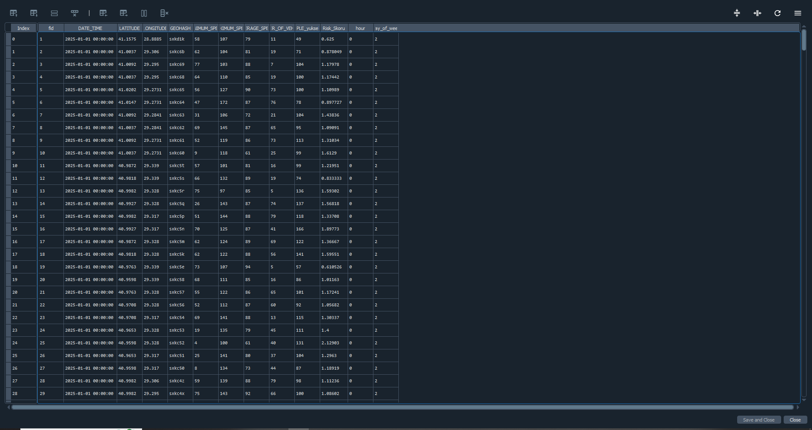
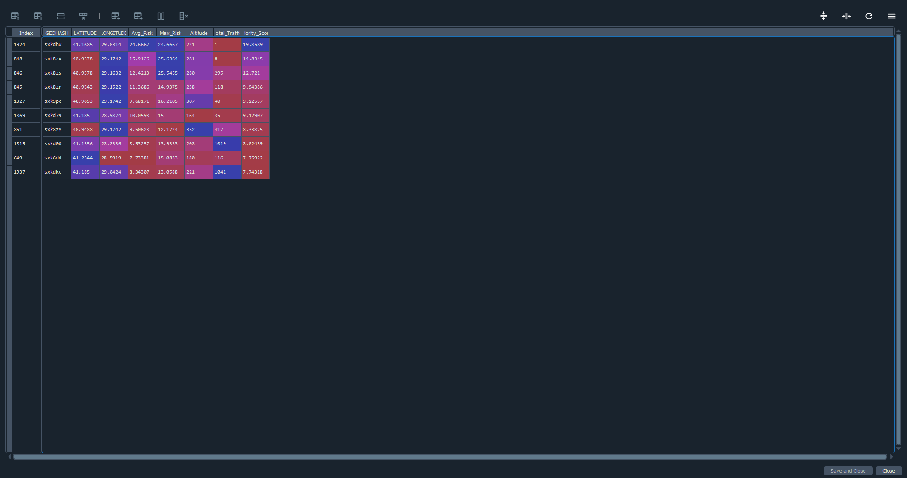
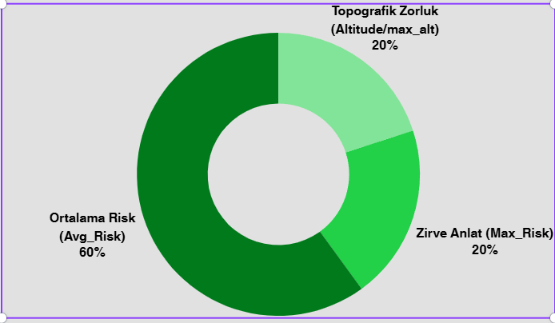
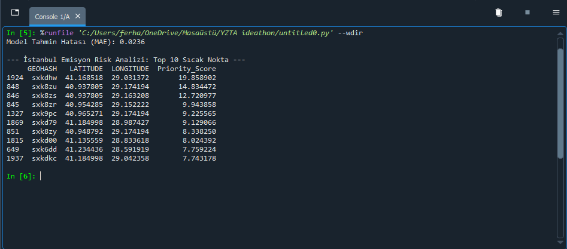

# 🌿 Eco-Dynamic Lite: Veri Tabanlı Emisyon Risk Analizi

İstanbul'un topografik yapısını trafik yoğunluk verileriyle sentezleyerek "sanal sensör" ağı oluşturan bir projedir.

## 📌 Problem Tanımı
İstanbul gibi yokuşlu metropollerde emisyon, sokağın topografik yapısına göre düz yola oranla %30-40 daha fazladır. Mevcut trafik verileri eğimi hesaplamazken, fiziksel sensörler yüksek maliyet nedeniyle her sokağa kurulamaz].

## 🚀 Teknik Yaklaşım & Veri Sentezi
- **Veri Kaynakları:** İBB Açık Veri Portalı (1.7 Milyon satırlık veri) ve 3B Sayısal Yükseklik Modeli (SYM).
- **Sentezleme:** Trafik ve SYM verileri QGIS ortamında birleştirilmiştir.
- **Model:** Random Forest Regressor algoritması kullanılmıştır.
- **Başarı Metriği:** Modelin Mutlak Hata Payı (MAE) **0.0236**'dır.

## 🧠 Risk Optimizasyon Formülü
Projemiz, kirliliği şu ağırlıklarla analiz eder:
* **%60 Ortalama Risk:** Şehrin kronik kirliliğini temsil eder.
* **%20 Zirve (Max) Risk:** Anlık trafik krizlerini temsil eder.
* **%20 Topografik Zorluk:** Yokuşların yarattığı motor yükünü temsil eder.
## 📊 Veri ve Analiz Görselleri

### 1. Trafik Yoğunluğu (Ocak 2025)
İstanbul'un sadece hıza odaklanan geleneksel trafik verisi:

### 2. Emisyon Risk Haritası (Eğim + Trafik Sentezi)
Hızın düşük, eğimin (yokuş) yüksek olduğu "gizli" emisyon odaklarını saptayan sentezlenmiş harita:

### 3. Veri Mimari Yapısı
Zaman, konum (GEOHASH), araç sayısı ve rakım verilerini bir araya getiren ana veri mimarimiz:

### 4. Model Çıktısı ve Parametreler
Random Forest Regressor algoritmamızın (MAE: 0.0236) karmaşık trafik-eğim ilişkilerini çözen parametre dökümü:

## 🧠 Risk Optimizasyonu
Algoritmamız, kirliliğin karakterini okumak için şu ağırlıkları kullanır:
* **%60 Ortalama Risk:** Şehrin kronik kirlilik alanları.
* **%20 Zirve (Max) Risk:** Anlık trafik krizleri.
* **%20 Topografik Zorluk:** Yokuşların yarattığı motor yükü.

## 🚀 Acil Müdahale Gerektiren İlk 10 Sıcak Nokta
Modelimiz tarafından tespit edilen, müdahale edildiğinde en yüksek çevresel faydayı (ROI) sağlayacak koordinatlar:

## 👥 Ekip (Takım - 99)
- **Ferhat Güdek:** Akademi Bursiyeri - Yapay Zeka.
- **Ilım Naz Şenol:** Akademi Bursiyeri - Veri Bilimi.
